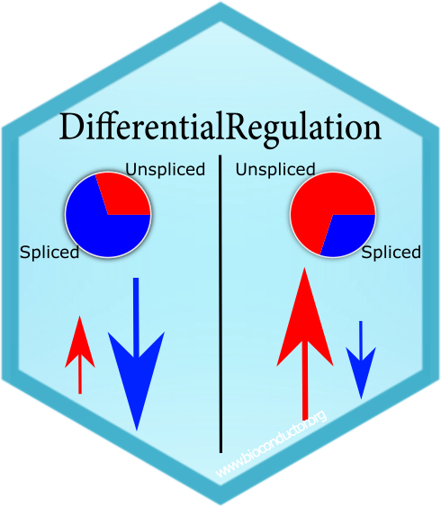

# DifferentialRegulation: a method to discover differentially regulated genes between conditions

 

`DifferentialRegulation` is a method for detecting differentially regulated genes between two groups of samples (e.g., healthy vs. disease, or treated vs. untreated samples), by targeting differences in the balance of spliced and unspliced mRNA abundances, obtained from single-cell RNA-sequencing (scRNA-seq) data.

Check the vignettes for a description of the main conceptual and mathematical aspects, as well as usage guidelines.

> Simone Tiberi, Joel Meili, Peiying Cai, Charlotte Soneson, Dongze He, Hirak Sarkar, Alejandra Avalos-Pacheco, Rob Patro, Mark D. Robinson.
>
> DifferentialRegulation: a Bayesian hierarchical approach to identify differentially regulated genes.
>
> Biostatistics (2024).
> Available [here](https://doi.org/10.1093/biostatistics/kxae017).


## Bioconductor installation 
`DifferentialRegulation` is available on [Bioconductor](https://bioconductor.org/packages/DifferentialRegulation) and can be installed with the command:
``` r
if (!requireNamespace("BiocManager", quietly=TRUE))
    install.packages("BiocManager")
BiocManager::install("DifferentialRegulation")
```

## Vignette
The vignette illustrating how to use the package can be accessed on 
[Bioconductor](https://bioconductor.org/packages/DifferentialRegulation)
or from R via:
``` r
vignette("DifferentialRegulation")
```
or
``` r
browseVignettes("DifferentialRegulation")
```
